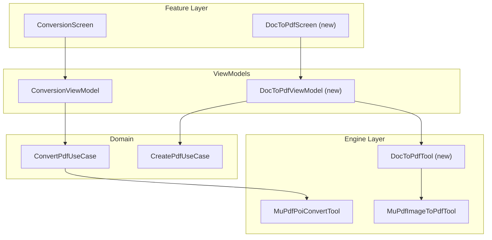
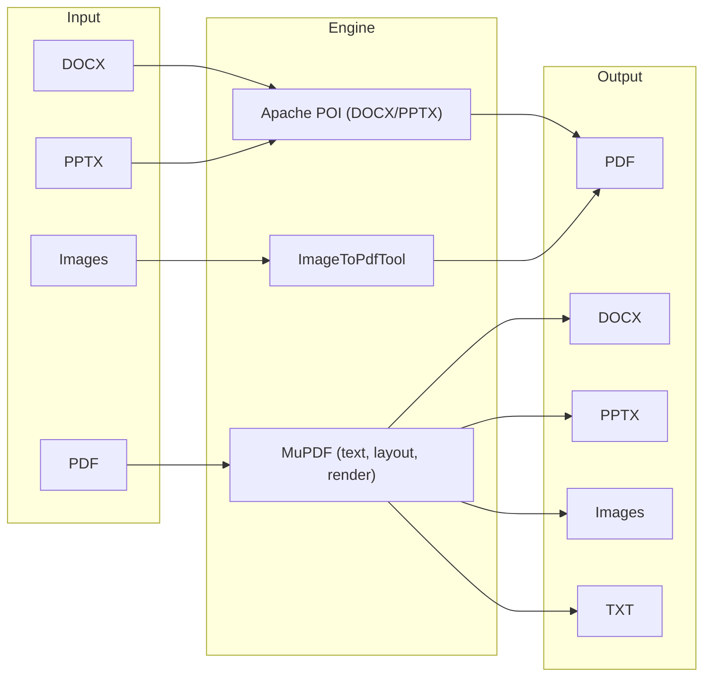
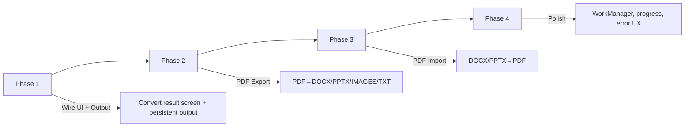

# PDF Forger — Conversion Architecture & Implementation Plan

**Date:** March 2025  
**Scope:** PDF ↔ document conversion (PDF→DOCX/PPTX/IMAGES/TXT, DOCX/PPTX/Images→PDF)  
**Goals:** Scalable, reliable, smartphone-efficient implementation

---

## 1. Current State

| Component | Status | Notes |
|-----------|--------|-------|
| **MuPdfPoiConvertTool** | ✅ Working | Uses `page.toStructuredText()` + Apache POI; PDF→DOCX only |
| **Output** | ⚠️ Temp file | Uses `createTempFile` → should use `createOutputFile` for persistence |
| **Formats** | DOCX only | targetFormat (DOCX/PPTX/IMAGES/TXT) ignored |
| **ConversionScreen** | ✅ Result screen | `onDocumentCreated` → `DocumentResultScreen` |
| **WorkManager** | ❌ Not wired | Convert runs in-process; no `OperationPayload.ConvertPdf` |
| **Document→PDF** | ✅ Image→PDF | Images supported; DOCX/PPTX→PDF not implemented |

---

## 2. Target Architecture

### 2.1 High-Level Flow



### 2.2 Conversion Direction Matrix



---

## 3. PDF → Other Formats (Export)

| Output | Engine | Strategy | Memory / Efficiency |
|--------|--------|----------|----------------------|
| **DOCX** | MuPDF + POI | `page.toStructuredText()` → XWPFDocument | Stream page-by-page; avoid holding all text in memory |
| **PPTX** | MuPDF + POI | 1 slide per page; text blocks or full-page image | Render pages lazily; consider low-res thumbnails for preview |
| **IMAGES** | MuPDF | `page.toPixmap()` → PNG/JPEG per page | Process one page at a time; flush to disk immediately |
| **TXT** | MuPDF | `page.toStructuredText()` → plain text | Lightweight; page streaming |

### 3.1 Efficiency for Smartphone

1. **Page streaming:** Process one page at a time; do not load entire PDF into memory.
2. **WorkManager:** Move long-running convert to background; report progress via `setProgress()`.
3. **Output to `filesDir/output/`:** Use `createOutputFile` (persistent) instead of `createTempFile` (cache).
4. **Format routing:** Use `targetFormat` to branch early—TXT path skips POI; IMAGES path skips POI, uses only MuPDF pixmap.
5. **Memory caps:** For large PDFs (e.g. 50+ pages), consider batched processing or “basic mode” (text-only, no layout).

---

## 4. Documents → PDF (Import)

| Input | Engine | Strategy |
|-------|--------|----------|
| **Images** | MuPdfImageToPdfTool | ✅ Exists; HEIF supported |
| **DOCX** | Apache POI + PDF writer | XWPFDocument → paragraphs/runs/images → PDF pages |
| **PPTX** | Apache POI | XMLSlideShow → one slide per PDF page (render to image or draw primitives) |

### 4.1 DOCX/PPTX → PDF Options

| Option | Pros | Cons |
|--------|------|------|
| **Apache POI + PDFBox** | Full control, Apache license | Extra dependency; manual layout |
| **Render to bitmap per page** | Simple, predictable | Large memory; quality vs size trade-off |
| **iText/OpenPDF** | Mature PDF API | License (AGPL) considerations |
| **Flying Saucer (HTML/CSS)** | Good for HTML→PDF | DOCX→HTML step adds complexity |

**Recommendation:** Start with **Apache POI + PDFBox** (or similar) for DOCX→PDF: load DOCX, iterate paragraphs/sections, draw text and images to PDF. This fits the existing POI usage and keeps dependencies consistent.

---

## 5. Modular Tool Design (Scalability)

### 5.1 Strategy Pattern per Format

```kotlin
// domain/core
interface ConvertPdfTool {
    suspend fun execute(params: ConvertPdfParams): OperationResult<Uri>
}

// engine: one tool delegates to format-specific handlers
class MuPdfPoiConvertTool {
    private val handlers: Map<String, ConvertHandler> = mapOf(
        "DOCX" to DocxConvertHandler(),
        "PPTX" to PptxConvertHandler(),
        "IMAGES" to ImagesConvertHandler(),
        "TXT" to TxtConvertHandler()
    )
    override suspend fun execute(params: ConvertPdfParams) =
        handlers[params.targetFormat]?.convert(params) ?: error(...)
}
```

- **Single entry point** for Convert; internal routing by format.
- **Pluggable handlers** so DOCX, PPTX, IMAGES, TXT can evolve independently.
- **Shared infra:** `MuPdfHelper.copyUriToTempFile`, `TempFileManager.createOutputFile`, error handling.

### 5.2 Document→PDF Extension

```kotlin
interface DocumentToPdfTool : PdfTool<DocumentToPdfParams>

data class DocumentToPdfParams(
    val sourceUri: Uri,
    val mimeType: String,  // application/vnd...docx, etc.
    val outputName: String
)
```

- Reuse `CreatePdfUseCase` for image inputs.
- Add `DocxToPdfTool` / `PptxToPdfTool` for document inputs.
- Use `DocumentToPdfUseCase` to select tool by MIME type.

---

## 6. Implementation Phases



| Phase | Tasks | Effort |
|-------|-------|--------|
| **1 — Wire Convert** | Add `onPdfCreated` to ConversionScreen; use `createOutputFile`; result screen; handle non-PDF MIME for “Open” | 1–2 h |
| **2 — PDF → Formats** | TXT (trivial); IMAGES (pixmap); improve DOCX; add PPTX handler | 4–8 h |
| **3 — Document → PDF** | `DocxToPdfTool`; `PptxToPdfTool`; new screen or extend Home | 6–12 h |
| **4 — Reliability** | WorkManager + `OperationPayload.ConvertPdf`; progress reporting; error messages | 2–4 h |

---

## 7. Reliability & SDLC Alignment

| Principle | Implementation |
|-----------|----------------|
| **Single responsibility** | One tool per conversion direction/format; use cases orchestrate only |
| **Dependency injection** | Hilt for tools; test with fakes |
| **Error handling** | `OperationResult.Error` with message; surface in UI |
| **Persistence** | `createOutputFile` for user-facing files; FileProvider for sharing |
| **Background work** | WorkManager for convert; survives process death |
| **Memory** | Page-streaming; avoid loading full document where possible |
| **Validation** | Use-case validates params before calling tool |

---

## 8. Suggested Next Steps

1. **Immediate (Phase 1):**  
   - Add `onPdfCreated` to ConversionScreen.  
   - Change MuPdfPoiConvertTool to use `createOutputFile` and return persistent file URI.  
   - Add Convert to result screen (generic `DocumentResultScreen` or extend `PdfResultScreen` for DOCX/PPTX preview).

2. **Short term (Phase 2):**  
   - Implement TXT and IMAGES export in `MuPdfPoiConvertTool` (or format handlers).  
   - Add PPTX export (1 slide per page).

3. **Medium term (Phase 3):**  
   - Add `DocxToPdfTool` and optional `PptxToPdfTool`.  
   - New flow: “Document to PDF” from Home.

4. **Ongoing:**  
   - Add WorkManager payload for Convert.  
   - Improve layout heuristics for complex PDFs (tables, columns).
