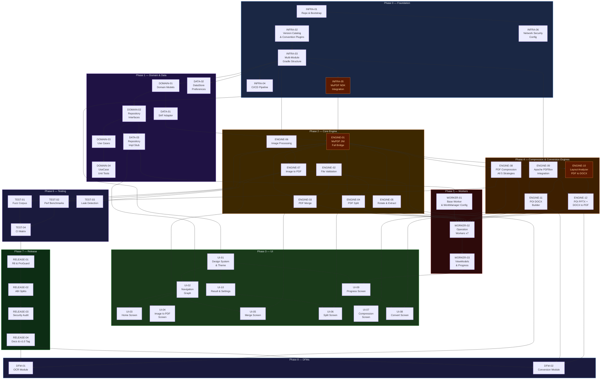

# PDFForge Android — Implementation Plan

> **Document Type:** Engineering Implementation Roadmap  
> **Follows:** `ARCHITECTURE.md` (read that first)  
> **Total Estimated Duration:** 14 months (solo) · 7 months (2–3 engineers)  
> **Methodology:** Milestone-gated, test-before-ship, no feature without tests  

---

## How to Read This Document

Every task has:
- A **task ID** (e.g., `INFRA-01`) for tracking
- An **estimated hours** range (honest, not optimistic)
- **Explicit blockers** — what must be done before this task starts
- **Definition of Done** — exact conditions that mark the task complete
- **Risk notes** where a task is non-trivial

Tasks are grouped into **phases**. Within each phase, tasks are ordered by dependency. Some tasks within a phase can run in parallel — this is marked explicitly.

---

## Phase 0 — Foundation & Infrastructure

> **Goal:** A buildable, testable project skeleton with CI running.  
> **Gate to Phase 1:** CI passes on every commit. MuPDF compiles and links. A "Hello World" Compose screen launches on a real device.  
> **Estimated Duration:** 2–3 weeks

---

### INFRA-01 — Repository & Project Bootstrap

**Blockers:** None — this is the first task.  
**Estimated Hours:** 4–6 h  

**Steps:**

1. Create GitHub repository: `pdfforge-android`
2. Initialize Android project via Android Studio with:
   - Empty Compose Activity template
   - Package name: `dev.pdfforge`
   - Min SDK: 29, Target SDK: 34
   - Kotlin DSL for all Gradle files
3. Add `.gitignore` (Android + NDK + IDE files)
4. Add `LICENSE` file (AGPL-3.0 full text)
5. Add `README.md` skeleton with project description and build instructions placeholder
6. Add `CONTRIBUTING.md` skeleton
7. Add `NOTICE` file template for third-party attribution
8. Initial commit and push

**Definition of Done:**
- Repository exists on GitHub with correct license
- Project builds with `./gradlew assembleDebug`
- Empty Compose activity launches on emulator

---

### INFRA-02 — Gradle Version Catalog & Convention Plugins

**Blockers:** INFRA-01  
**Estimated Hours:** 6–10 h  

**Steps:**

1. Create `gradle/libs.versions.toml` with all dependency declarations:

```toml
[versions]
kotlin = "1.9.22"
compose-bom = "2024.02.00"
hilt = "2.50"
workmanager = "2.9.0"
pdfbox = "3.0.1"
poi = "5.2.5"
coroutines = "1.7.3"
agp = "8.2.2"
navigation = "2.7.6"
datastore = "1.0.0"
junit5 = "5.10.1"
mockk = "1.13.9"
detekt = "1.23.4"

[libraries]
compose-bom = { group = "androidx.compose", name = "compose-bom", version.ref = "compose-bom" }
compose-ui = { group = "androidx.compose.ui", name = "ui" }
compose-material3 = { group = "androidx.compose.material3", name = "material3" }
hilt-android = { group = "com.google.dagger", name = "hilt-android", version.ref = "hilt" }
hilt-compiler = { group = "com.google.dagger", name = "hilt-android-compiler", version.ref = "hilt" }
workmanager-ktx = { group = "androidx.work", name = "work-runtime-ktx", version.ref = "workmanager" }
pdfbox = { group = "org.apache.pdfbox", name = "pdfbox", version.ref = "pdfbox" }
poi-ooxml = { group = "org.apache.poi", name = "poi-ooxml-lite", version.ref = "poi" }
coroutines-android = { group = "org.jetbrains.kotlinx", name = "kotlinx-coroutines-android", version.ref = "coroutines" }
navigation-compose = { group = "androidx.navigation", name = "navigation-compose", version.ref = "navigation" }
datastore-prefs = { group = "androidx.datastore", name = "datastore-preferences", version.ref = "datastore" }
junit5-api = { group = "org.junit.jupiter", name = "junit-jupiter-api", version.ref = "junit5" }
junit5-engine = { group = "org.junit.jupiter", name = "junit-jupiter-engine", version.ref = "junit5" }
mockk = { group = "io.mockk", name = "mockk", version.ref = "mockk" }
coroutines-test = { group = "org.jetbrains.kotlinx", name = "kotlinx-coroutines-test", version.ref = "coroutines" }

[plugins]
android-application = { id = "com.android.application", version.ref = "agp" }
android-library = { id = "com.android.library", version.ref = "agp" }
kotlin-android = { id = "org.jetbrains.kotlin.android", version.ref = "kotlin" }
hilt = { id = "com.google.dagger.hilt.android", version.ref = "hilt" }
detekt = { id = "io.gitlab.arturbosch.detekt", version.ref = "detekt" }
```

2. Create `build-logic/` directory with Convention Plugins:
   - `AndroidLibraryConventionPlugin.kt` — shared config for all `:engine:*`, `:data:*`, `:domain:*` modules
   - `AndroidFeatureConventionPlugin.kt` — adds Compose, Navigation, ViewModel for `:feature:*` modules
   - `EngineModuleConventionPlugin.kt` — adds NDK/CMake config for `:engine:mupdf`, `:engine:tesseract`
   - `TestConventionPlugin.kt` — JUnit 5, MockK, coroutines-test setup

3. Apply convention plugins to `settings.gradle.kts`

**Definition of Done:**
- `./gradlew dependencies` resolves all declared dependencies
- No version conflicts in dependency graph
- Convention plugins apply cleanly to a test module

---

### INFRA-03 — Multi-Module Gradle Structure

**Blockers:** INFRA-02  
**Estimated Hours:** 8–12 h  

**Steps:**

1. Create all module directories (empty, with `build.gradle.kts` and placeholder `src/`):

```
:domain:core
:domain:models
:data:impl
:data:storage
:engine:mupdf
:engine:pdfbox
:engine:imageproc
:engine:converter
:engine:tesseract
:feature:pdf_creation
:feature:compression
:feature:conversion
:feature:merge_split
:common:ui
:common:utils
:benchmarks
```

2. Register all modules in `settings.gradle.kts`
3. Wire module dependencies in each `build.gradle.kts` per Architecture doc
4. Verify build graph: `./gradlew projects`
5. Verify no circular dependencies: install and run `dependency-guard` plugin baseline

**Definition of Done:**
- `./gradlew assembleDebug` succeeds with all empty modules
- `./gradlew :domain:core:test` runs (0 tests — passes vacuously)
- Module graph matches Architecture doc exactly

---

### INFRA-04 — CI/CD GitHub Actions Pipeline

**Blockers:** INFRA-03  
**Estimated Hours:** 6–8 h  

**Steps:**

1. Create `.github/workflows/ci.yml`:
   - Trigger: push to `main`/`develop`, all PRs to `main`
   - Jobs: `lint` → `unit-tests` → `build-debug` (sequential, fail-fast)
   - Cache: Gradle cache, NDK cache
2. Create `.github/workflows/release.yml`:
   - Trigger: push of `v*` tags
   - Jobs: build release APKs (per-ABI), sign, create GitHub Release, upload APKs
3. Create `.github/workflows/license-check.yml`:
   - Uses `licensee` or FOSSA action
   - Fails if any dependency with incompatible license is introduced
4. Add PR template: `.github/PULL_REQUEST_TEMPLATE.md`
5. Add issue templates: bug report, feature request
6. Add `detekt.yml` config file
7. Add `.editorconfig` for consistent code style

**Definition of Done:**
- CI runs and passes on initial empty commit
- A test PR triggers CI and results are visible in PR checks
- Release workflow completes when a `v0.0.1` tag is pushed (produces APKs as artifacts)

---

### INFRA-05 — MuPDF NDK Integration (Critical Path)

**Blockers:** INFRA-03  
> ⚠️ **This is the highest-risk task in the project. Allocate buffer time.**

**Estimated Hours:** 20–32 h  

**Steps:**

1. Add MuPDF as git submodule:
   ```bash
   git submodule add https://git.ghostscript.com/mupdf.git engine/mupdf/libs/mupdf-src
   git submodule update --init --recursive
   cd engine/mupdf/libs/mupdf-src && git checkout 1.24.0
   ```

2. Create `scripts/build_mupdf.sh`:
   ```bash
   #!/bin/bash
   # Build MuPDF static library for Android ABIs
   NDK_PATH=${ANDROID_NDK_HOME}
   for ABI in armeabi-v7a arm64-v8a; do
     make -C mupdf-src \
       build=release \
       OS=android \
       ANDROID_NDK=${NDK_PATH} \
       ANDROID_ABI=${ABI} \
       HAVE_GLUT=no \
       HAVE_CURL=no \
       HAVE_JAVASCRIPT=no \
       shared=no \
       libmupdf.a
     cp mupdf-src/build/release/libmupdf.a ../prebuilt/${ABI}/
   done
   ```

3. Create `engine/mupdf/src/main/cpp/CMakeLists.txt`:
   ```cmake
   cmake_minimum_required(VERSION 3.22.1)
   project("mupdf_bridge")
   
   add_library(mupdf STATIC IMPORTED)
   set_target_properties(mupdf PROPERTIES
     IMPORTED_LOCATION ${CMAKE_SOURCE_DIR}/../prebuilt/${ANDROID_ABI}/libmupdf.a)
   
   add_library(mupdf_bridge SHARED mupdf_bridge.cpp)
   target_include_directories(mupdf_bridge PRIVATE
     ${CMAKE_SOURCE_DIR}/../../../../libs/mupdf-src/include)
   target_link_libraries(mupdf_bridge mupdf android log)
   ```

4. Write minimal `mupdf_bridge.cpp` with JNI functions:
   - `openFromFd(fd: Int): Long`
   - `closeDocument(handle: Long)`
   - `getPageCount(handle: Long): Int`

5. Write `MuPdfJni.kt` with matching `external fun` declarations
6. Write `MuPdfEngineTest.kt` that opens a real test PDF via JNI and asserts page count
7. Add pre-built `.a` files to CI cache to avoid rebuilding MuPDF on every CI run

**Definition of Done:**
- `./gradlew :engine:mupdf:connectedAndroidTest` passes on emulator
- A real PDF is opened via JNI and page count returned correctly
- No JNI crashes (`SIGSEGV`) on valid PDF input
- Library size verified: `libmupdf_bridge.so` < 10 MB stripped

---

### INFRA-06 — Network Security Config (Privacy Baseline)

**Blockers:** INFRA-01  
**Estimated Hours:** 1–2 h  

**Steps:**

1. Create `app/src/main/res/xml/network_security_config.xml`:
   ```xml
   <?xml version="1.0" encoding="utf-8"?>
   <network-security-config>
     <!-- Block ALL network traffic. This app is 100% offline. -->
     <base-config cleartextTrafficPermitted="false">
       <trust-anchors/>
     </base-config>
   </network-security-config>
   ```
2. Reference in `AndroidManifest.xml`:
   ```xml
   android:networkSecurityConfig="@xml/network_security_config"
   ```
3. Verify `INTERNET` permission is absent from manifest
4. Add `StrictMode` in `Application.onCreate()` for debug builds:
   ```kotlin
   if (BuildConfig.DEBUG) {
     StrictMode.setThreadPolicy(StrictMode.ThreadPolicy.Builder()
       .detectAll().penaltyLog().penaltyDeath().build())
   }
   ```

**Definition of Done:**
- App cannot make any network request (verified by attempting `URL.openConnection()` in a debug test — it fails)
- StrictMode triggers on any accidental main-thread I/O in debug builds

---

## Phase 1 — Domain & Data Layer

> **Goal:** All use cases, repository interfaces, models, and SAF plumbing coded and unit-tested.  
> **Gate to Phase 2:** Every use case has ≥ 85% branch coverage. SAF adapter can read/write test URIs.  
> **Estimated Duration:** 2–3 weeks  

---

### DOMAIN-01 — Domain Models

**Blockers:** INFRA-03  
**Estimated Hours:** 4–6 h  
**Can run parallel with:** Nothing else yet, but unblocks everything.

**Steps:**

1. In `:domain:models`, create:

```kotlin
// OperationResult.kt
sealed class OperationResult<out T> {
    data class Success<T>(val data: T, val metadata: OperationMetadata = OperationMetadata()) : OperationResult<T>()
    data class Error(val code: ErrorCode, val message: String = "", val cause: Throwable? = null) : OperationResult<Nothing>()
    data object Cancelled : OperationResult<Nothing>()
}

data class OperationMetadata(
    val durationMs: Long = 0L,
    val inputSizeBytes: Long = 0L,
    val outputSizeBytes: Long = 0L,
)

// ErrorCode.kt
sealed class ErrorCode {
    // File errors
    data object FILE_NOT_FOUND : ErrorCode()
    data object FILE_TOO_LARGE : ErrorCode()
    data object FILE_TOO_SMALL : ErrorCode()
    data object NOT_A_PDF : ErrorCode()
    data object CANNOT_OPEN_FILE : ErrorCode()
    data object CANNOT_WRITE_FILE : ErrorCode()
    data object STORAGE_PERMISSION_LOST : ErrorCode()
    // Input errors
    data object INSUFFICIENT_INPUT : ErrorCode()
    data object INVALID_PAGE_RANGE : ErrorCode()
    data object PAGE_INDEX_OUT_OF_BOUNDS : ErrorCode()
    // Engine errors
    data object INVALID_PDF : ErrorCode()
    data object PDF_ENCRYPTED : ErrorCode()
    data object PDF_CORRUPTED : ErrorCode()
    data object ENGINE_OUT_OF_MEMORY : ErrorCode()
    data object ENGINE_INTERNAL_ERROR : ErrorCode()
    // Conversion errors
    data object OCR_MODULE_NOT_INSTALLED : ErrorCode()
    data object CONVERSION_MODULE_NOT_INSTALLED : ErrorCode()
    data object UNSUPPORTED_SOURCE_FORMAT : ErrorCode()
}

// PdfDocument.kt
data class PdfDocument(
    val uri: Uri,
    val pageCount: Int,
    val fileSizeBytes: Long,
    val title: String?,
    val author: String?,
    val isEncrypted: Boolean,
    val isLinearized: Boolean,
)

// PageInfo.kt
data class PageInfo(
    val index: Int,               // 0-based
    val widthPt: Float,           // PDF points
    val heightPt: Float,
    val rotationDegrees: Int,     // 0, 90, 180, 270
)

// ToolParams.kt — sealed per tool
sealed class ToolParams {
    data class ImageToPdf(val imageUris: List<Uri>, val quality: Int = 85, val pageSize: PageSize = PageSize.A4) : ToolParams()
    data class MergePdf(val pdfUris: List<Uri>, val stripMetadata: Boolean = false) : ToolParams()
    data class SplitPdf(val pdfUri: Uri, val mode: SplitMode) : ToolParams()
    data class CompressPdf(val pdfUri: Uri, val strategies: Set<CompressionStrategy>) : ToolParams()
    data class ConvertPdf(val pdfUri: Uri, val targetFormat: ConversionFormat) : ToolParams()
    data class RotatePages(val pdfUri: Uri, val pageIndices: List<Int>, val degrees: Int) : ToolParams()
    data class ExtractPages(val pdfUri: Uri, val pageRange: PageRange) : ToolParams()
}
```

2. Create all enums: `PageSize`, `SplitMode`, `CompressionStrategy`, `ConversionFormat`, `PageRange`

**Definition of Done:**
- All model classes compile
- All sealed classes are exhaustive (no `else` branches needed in `when`)
- 100% of model classes have KDoc

---

### DOMAIN-02 — Repository Interfaces

**Blockers:** DOMAIN-01  
**Estimated Hours:** 3–4 h  

**Steps:**

```kotlin
// PdfRepository.kt — in :domain:core
interface PdfRepository {
    suspend fun openDocument(uri: Uri): OperationResult<PdfDocument>
    suspend fun getPageInfo(uri: Uri, pageIndex: Int): OperationResult<PageInfo>
    suspend fun getAllPageInfo(uri: Uri): Flow<PageInfo>

    suspend fun createFromImages(params: ToolParams.ImageToPdf, progress: (Int) -> Unit): OperationResult<Uri>
    suspend fun merge(params: ToolParams.MergePdf, progress: (Int) -> Unit): OperationResult<Uri>
    suspend fun split(params: ToolParams.SplitPdf, progress: (Int) -> Unit): OperationResult<List<Uri>>
    suspend fun compress(params: ToolParams.CompressPdf, progress: (Int) -> Unit): OperationResult<Uri>
    suspend fun convert(params: ToolParams.ConvertPdf, progress: (Int) -> Unit): OperationResult<Uri>
    suspend fun rotatePages(params: ToolParams.RotatePages): OperationResult<Uri>
    suspend fun extractPages(params: ToolParams.ExtractPages): OperationResult<Uri>

    suspend fun validateFile(uri: Uri): OperationResult<PdfDocument>
    fun cancel(operationId: String)
}
```

**Definition of Done:**
- Interface compiles with zero Android imports
- KDoc on every function
- Verified: `:domain:core` has zero transitive Android framework dependencies (`./gradlew :domain:core:dependencies`)

---

### DOMAIN-03 — Use Cases

**Blockers:** DOMAIN-02  
**Estimated Hours:** 10–14 h  

Write one UseCase class per operation. All identical structure — only params and delegate call differ.

```kotlin
// MergePdfUseCase.kt
class MergePdfUseCase @Inject constructor(
    private val repository: PdfRepository
) {
    suspend fun execute(
        params: ToolParams.MergePdf,
        onProgress: (Int) -> Unit = {}
    ): OperationResult<Uri> {
        // Validate before touching engine
        if (params.pdfUris.size < 2)
            return OperationResult.Error(ErrorCode.INSUFFICIENT_INPUT,
                "Merge requires at least 2 PDF files")
        if (params.pdfUris.size > 50)
            return OperationResult.Error(ErrorCode.INSUFFICIENT_INPUT,
                "Merge supports maximum 50 files at once")

        // Validate each file
        params.pdfUris.forEach { uri ->
            val validation = repository.validateFile(uri)
            if (validation is OperationResult.Error) return validation
        }

        return repository.merge(params, onProgress)
    }
}
```

Use cases to implement (all follow same pattern):
- `CreatePdfFromImagesUseCase` — validates ≥ 1 image, quality in 1–100
- `MergePdfUseCase` — validates 2–50 PDFs
- `SplitPdfUseCase` — validates split mode params
- `CompressPdfUseCase` — validates at least 1 strategy selected
- `ConvertPdfUseCase` — validates format, checks DFM availability
- `RotatePagesUseCase` — validates degrees ∈ {90, 180, 270}, page indices in range
- `ExtractPagesUseCase` — validates page range

**Definition of Done:**
- All 7 use cases written
- All validation branches tested in unit tests
- 0 Android imports in `:domain:core`
- Coverage ≥ 90% on use case logic

---

### DOMAIN-04 — Use Case Unit Tests

**Blockers:** DOMAIN-03  
**Estimated Hours:** 8–12 h  
**Can run parallel with:** DOMAIN-03 (TDD — write tests alongside)

```kotlin
// Tests for EVERY use case:
// - Happy path: valid input → Success result
// - Validation errors: each invalid input → correct ErrorCode
// - Repository error propagation: mock repo returns Error → use case returns same Error
// - Progress callback: verify callbacks fired in correct order
// - Cancellation: CancellationException propagates correctly

// Target: 100% branch coverage on all UseCase classes
```

**Definition of Done:**
- All use case test classes exist
- `./gradlew :domain:core:test` passes with 0 failures
- JaCoCo report shows ≥ 90% line coverage on all UseCase classes

---

### DATA-01 — SAF File Adapter

**Blockers:** DOMAIN-01  
**Estimated Hours:** 8–12 h  

```kotlin
// SafFileAdapter.kt — thin wrapper over ContentResolver
class SafFileAdapter @Inject constructor(
    @ApplicationContext private val context: Context
) {
    fun openInputStream(uri: Uri): InputStream =
        context.contentResolver.openInputStream(uri)
            ?: throw IOException("Cannot open stream for URI: $uri")

    fun openOutputStream(uri: Uri): OutputStream =
        context.contentResolver.openOutputStream(uri)
            ?: throw IOException("Cannot open output stream for URI: $uri")

    fun openFileDescriptor(uri: Uri, mode: String): ParcelFileDescriptor =
        context.contentResolver.openFileDescriptor(uri, mode)
            ?: throw IOException("Cannot open file descriptor for URI: $uri")

    fun queryFileSize(uri: Uri): Long =
        context.contentResolver.query(uri, arrayOf(OpenableColumns.SIZE), null, null, null)
            ?.use { c -> c.moveToFirst(); c.getLong(0) } ?: -1L

    fun queryFileName(uri: Uri): String =
        context.contentResolver.query(uri, arrayOf(OpenableColumns.DISPLAY_NAME), null, null, null)
            ?.use { c -> c.moveToFirst(); c.getString(0) } ?: "document"

    fun createDocumentInFolder(folderUri: Uri, mimeType: String, name: String): Uri {
        val folder = DocumentFile.fromTreeUri(context, folderUri)
            ?: throw IOException("Cannot access folder: $folderUri")
        return folder.createFile(mimeType, name)?.uri
            ?: throw IOException("Cannot create file: $name in $folderUri")
    }
}
```

**Steps:**
1. Write `SafFileAdapter` as above
2. Write `FileValidator` (magic bytes + size + MIME validation)
3. Write `TempFileManager` with `finally`-block cleanup guarantee
4. Write `PdfNamingStrategy` — generates output filenames from input names

**Definition of Done:**
- `SafFileAdapter` tested with Robolectric using `ShadowContentResolver`
- `FileValidator` tested with real byte arrays (valid PDF header, truncated, wrong magic)
- `TempFileManager` verified: no temp files remain after `deleteAll()` call

---

### DATA-02 — DataStore Preferences

**Blockers:** INFRA-03  
**Estimated Hours:** 3–4 h  
**Can run parallel with:** DATA-01

```kotlin
// UserPreferences.kt
data class UserPreferences(
    val defaultJpegQuality: Int = 85,          // 1–100
    val defaultTargetDpi: Int = 150,           // for downscale strategy
    val defaultPageSize: PageSize = PageSize.A4,
    val stripMetadataByDefault: Boolean = false,
    val keepOriginalOnOutput: Boolean = true,   // don't overwrite input files
    val outputFilenameSuffix: String = "_pdfforge", // appended to output files
    val showConversionQualityWarning: Boolean = true,
    val lastUsedOutputUri: String? = null,
)

// UserPreferencesDataStore.kt
class UserPreferencesDataStore @Inject constructor(
    @ApplicationContext private val context: Context
) {
    private val dataStore = context.createDataStore("user_preferences")

    val preferences: Flow<UserPreferences> = dataStore.data.map { prefs ->
        UserPreferences(
            defaultJpegQuality = prefs[JPEG_QUALITY_KEY] ?: 85,
            // ... map all keys
        )
    }

    suspend fun updateJpegQuality(quality: Int) = dataStore.edit {
        it[JPEG_QUALITY_KEY] = quality.coerceIn(1, 100)
    }
    // ... update functions per preference
}
```

**Definition of Done:**
- DataStore compiles and reads/writes correctly in Robolectric test
- All preference keys have default values
- No `SharedPreferences` used anywhere in the project

---

### DATA-03 — Repository Implementation (Stub)

**Blockers:** DATA-01, DOMAIN-02  
**Estimated Hours:** 6–8 h  

Implement `PdfRepositoryImpl` as a **stub** — it implements the interface but delegates to `throw NotImplementedError("Phase 1: engine not yet connected")` for each method. Wire up DI.

The goal here is to get Hilt DI working end-to-end before engines are built.

```kotlin
@HiltViewModel
class MergeViewModel @Inject constructor(
    private val mergeUseCase: MergePdfUseCase
) : ViewModel() { ... }

@Module
@InstallIn(SingletonComponent::class)
object RepositoryModule {
    @Provides @Singleton
    fun providePdfRepository(impl: PdfRepositoryImpl): PdfRepository = impl
}
```

**Definition of Done:**
- Hilt builds successfully with all modules wired
- `@HiltAndroidTest` test can inject `PdfRepository` without crash
- All use cases can be instantiated with injected repository (even if stub)

---

## Phase 2 — Core Engine Integration

> **Goal:** MuPDF engine fully integrated. PDF merge, split, rotate, extract work end-to-end.  
> **Gate to Phase 3:** All Phase 2 operations work on real device with real PDFs, including 100-page test PDFs.  
> **Estimated Duration:** 3–5 weeks  

---

### ENGINE-01 — MuPDF JNI Bridge — Full Implementation

**Blockers:** INFRA-05, DATA-01  
**Estimated Hours:** 24–40 h  
> ⚠️ **Risk:** JNI memory management is error-prone. Take time to get this right. Leaks here cause OOM on production.

**Steps:**

1. Define the complete JNI function set in `MuPdfJni.kt`
2. Implement each function in `mupdf_bridge.cpp`:

```cpp
// Document lifecycle
extern "C" JNIEXPORT jlong JNICALL openFromFd(JNIEnv*, jobject, jint fd);
extern "C" JNIEXPORT jlong JNICALL openEmpty(JNIEnv*, jobject);
extern "C" JNIEXPORT void JNICALL closeDocument(JNIEnv*, jobject, jlong handle);
extern "C" JNIEXPORT jint JNICALL getPageCount(JNIEnv*, jobject, jlong handle);

// Page operations
extern "C" JNIEXPORT void JNICALL copyPage(JNIEnv*, jobject, jlong src, jlong dst, jint pageIdx);
extern "C" JNIEXPORT jfloatArray JNICALL getPageDimensions(JNIEnv*, jobject, jlong handle, jint pageIdx);
extern "C" JNIEXPORT void JNICALL rotatePage(JNIEnv*, jobject, jlong handle, jint pageIdx, jint degrees);

// Writing
extern "C" JNIEXPORT jstring JNICALL writeToCacheFile(JNIEnv*, jobject, jlong handle, jstring path, jboolean linearize);

// Validation
extern "C" JNIEXPORT jboolean JNICALL isEncrypted(JNIEnv*, jobject, jlong handle);
extern "C" JNIEXPORT jobjectArray JNICALL getMetadata(JNIEnv*, jobject, jlong handle);

// Image insertion (for Image→PDF)
extern "C" JNIEXPORT void JNICALL insertImagePage(JNIEnv*, jobject, jlong handle, jint pageIdx, jbyteArray imgBytes, jint width, jint height, jfloat pageWidthPt, jfloat pageHeightPt);

// Compression
extern "C" JNIEXPORT jstring JNICALL writeCompressed(JNIEnv*, jobject, jlong handle, jstring path, jboolean noInfo, jboolean noXmp, jboolean compress, jboolean linearize);
```

3. Implement `DocHandle` struct in C++ to hold `fz_context*` + `fz_document*` as single opaque `jlong`
4. **Memory rule:** Every `fz_try` must have matching `fz_catch`. Every `fz_drop_*` in the finally path.
5. Write exhaustive JNI tests using real PDF files from `src/androidTest/assets/`

**Definition of Done:**
- 0 `SIGSEGV` crashes on 50 test PDFs (valid + some malformed)
- `valgrind` or LeakSanitizer run shows 0 memory leaks on JNI open→process→close cycle
- All JNI functions have matching Kotlin tests
- `libmupdf_bridge.so` < 10 MB stripped

---

### ENGINE-02 — File Validation Layer

**Blockers:** ENGINE-01  
**Estimated Hours:** 4–6 h  
**Can run parallel with:** ENGINE-03

```kotlin
// FileValidator.kt
class FileValidator @Inject constructor(private val safAdapter: SafFileAdapter) {
    companion object {
        private val PDF_MAGIC = byteArrayOf(0x25, 0x50, 0x44, 0x46) // %PDF
        const val MAX_FILE_SIZE_BYTES = 500 * 1024 * 1024L // 500 MB
        const val MIN_FILE_SIZE_BYTES = 512L
    }

    fun validate(uri: Uri): ValidationResult {
        val size = safAdapter.queryFileSize(uri)
        if (size < MIN_FILE_SIZE_BYTES) return ValidationResult.TooSmall
        if (size > MAX_FILE_SIZE_BYTES) return ValidationResult.TooLarge
        val magic = ByteArray(4)
        safAdapter.openInputStream(uri).use { it.read(magic) }
        if (!magic.contentEquals(PDF_MAGIC)) return ValidationResult.NotAPdf
        return ValidationResult.Valid(size)
    }
}
```

**Definition of Done:**
- Tested with: valid PDF, truncated PDF, zero bytes, JPEG mistakenly selected, 501 MB file
- All edge cases return correct `ValidationResult` subtype

---

### ENGINE-03 — PDF Merge Implementation

**Blockers:** ENGINE-01, ENGINE-02  
**Estimated Hours:** 8–12 h  

**Steps:**

1. Implement `PdfRepositoryImpl.merge()` using MuPDF JNI:
   - Validate each input URI via `FileValidator`
   - Create empty output document via `MuPdfJni.openEmpty()`
   - For each source: open → copy all pages → drop source
   - Write output to temp file → stream to SAF URI → delete temp
2. Implement progress callback: emit `((docIndex * 100) / totalDocs)`
3. Implement cancellation: check `CancellationSignal` between documents
4. Write `MergePdfWorker` (WorkManager CoroutineWorker)
5. Write integration test: merge 3 test PDFs → verify output page count = sum of inputs

**Definition of Done:**
- Merges 3 PDFs of 10 pages each → 30-page output ✅
- Merges a 200-page PDF with a 50-page PDF → 250 pages ✅
- Cancellation mid-merge: no output file written, no temp file left ✅
- Progress callbacks fire between 0–100 ✅

---

### ENGINE-04 — PDF Split Implementation

**Blockers:** ENGINE-01, ENGINE-02  
**Estimated Hours:** 8–12 h  
**Can run parallel with:** ENGINE-03

**Steps:**

1. Implement `SplitMode` handlers:
   - `EveryNPages(n: Int)` — generate ranges automatically
   - `CustomRanges(ranges: List<IntRange>)` — parse and validate
   - `ByBookmarks` — `fz_load_outline()`, extract top-level chapter page ranges
2. Implement `PdfRepositoryImpl.split()`
3. Write `SplitPdfWorker`
4. Handle edge case: range exceeds page count → error per-range, not global abort
5. Test: split 20-page PDF every 5 pages → 4 output files of 5 pages each

**Definition of Done:**
- All 3 split modes produce correct output page counts ✅
- Custom range "1, 3-5, 8, 10-end" on 12-page PDF → [1], [3,4,5], [8], [10,11,12] ✅
- Invalid ranges reported without crashing ✅
- Output files named correctly: `original_part1.pdf`, `original_part2.pdf` ✅

---

### ENGINE-05 — Rotate & Extract Pages

**Blockers:** ENGINE-01  
**Estimated Hours:** 6–8 h  
**Can run parallel with:** ENGINE-03, ENGINE-04

**Steps:**

1. Implement rotate: modify page `/Rotate` dict entry via MuPDF, rewrite document
2. Implement extract pages: copy selected pages to new document (same pattern as merge)
3. Both operations: read from SAF URI → process → write to new SAF URI (never overwrite input)

**Definition of Done:**
- Rotate 90°: page dimensions swap in output ✅
- Rotate 180° twice = original ✅
- Extract pages 1, 3, 5 from 10-page PDF → 3-page output with correct content ✅

---

### ENGINE-06 — Image Processing Module

**Blockers:** INFRA-03  
**Estimated Hours:** 8–10 h  
**Can run parallel with:** ENGINE-03, ENGINE-04, ENGINE-05

**Steps:**

1. Implement `BitmapProcessor.kt` in `:engine:imageproc`:

```kotlin
class BitmapProcessor @Inject constructor() {

    fun safeDecodeFromUri(uri: Uri, context: Context, targetWidthPx: Int = 2480): Bitmap? {
        val opts = BitmapFactory.Options().apply { inJustDecodeBounds = true }
        context.contentResolver.openInputStream(uri)?.use { BitmapFactory.decodeStream(it, null, opts) }
        opts.inSampleSize = calculateInSampleSize(opts.outWidth, opts.outHeight, targetWidthPx)
        opts.inJustDecodeBounds = false
        opts.inPreferredConfig = Bitmap.Config.RGB_565
        return context.contentResolver.openInputStream(uri)?.use { BitmapFactory.decodeStream(it, null, opts) }
    }

    fun applyRotation(bitmap: Bitmap, degrees: Int): Bitmap {
        val matrix = Matrix().apply { postRotate(degrees.toFloat()) }
        return Bitmap.createBitmap(bitmap, 0, 0, bitmap.width, bitmap.height, matrix, true)
            .also { if (it != bitmap) bitmap.recycle() }
    }

    fun compressToBytes(bitmap: Bitmap, quality: Int): ByteArray =
        ByteArrayOutputStream().use { out ->
            bitmap.compress(Bitmap.CompressFormat.JPEG, quality, out)
            out.toByteArray()
        }

    fun tileDecodeLargeImage(uri: Uri, context: Context, tileHeightPx: Int = 512, consumer: (Bitmap) -> Unit) {
        val stream = context.contentResolver.openInputStream(uri) ?: return
        val decoder = BitmapRegionDecoder.newInstance(stream, false) ?: return
        try {
            var y = 0
            while (y < decoder.height) {
                val region = Rect(0, y, decoder.width, minOf(y + tileHeightPx, decoder.height))
                val tile = decoder.decodeRegion(region, null) ?: break
                consumer(tile)
                tile.recycle()
                y += tileHeightPx
            }
        } finally { decoder.recycle(); stream.close() }
    }

    private fun calculateInSampleSize(srcWidth: Int, srcHeight: Int, targetWidth: Int): Int {
        var sample = 1
        while (srcWidth / (sample * 2) >= targetWidth) sample *= 2
        return sample
    }
}
```

**Definition of Done:**
- Safe decode tested with: 1 MP image, 12 MP image, 48 MP image (no OOM) ✅
- Tile decode tested with synthetic 200 MP image ✅
- Rotation tested for 90, 180, 270 degrees ✅
- Memory: no bitmap references retained after processing ✅

---

### ENGINE-07 — Image to PDF Implementation

**Blockers:** ENGINE-01, ENGINE-06  
**Estimated Hours:** 10–14 h  

**Steps:**

1. Implement `PdfRepositoryImpl.createFromImages()`:
   - For each image URI: `BitmapProcessor.safeDecodeFromUri()`
   - Compress bitmap to JPEG bytes via `BitmapProcessor.compressToBytes(quality)`
   - Call `MuPdfJni.insertImagePage(docHandle, pageIndex, jpegBytes, w, h, pageWidthPt, pageHeightPt)`
   - Recycle bitmap immediately after JNI call
2. Calculate page dimensions: A4 = 595 × 842 pt, Letter = 612 × 792 pt
3. Fit image to page: maintain aspect ratio, add white padding if needed
4. Implement batch processing: `ImageToPdfWorker` processes queue serially
5. Test: 10 images → 10-page PDF, verify each page has correct content

**Definition of Done:**
- 10 photos (12 MP each) → 10-page PDF in < 8 seconds on mid-range emulator ✅
- No OOM crash on batch of 20 images ✅
- Output file size is reasonable (JPEG quality 85: ~2–5 MB for 10 photos) ✅
- Page dimensions match selected page size ✅

---

## Phase 3 — UI Layer

> **Goal:** Complete, usable Compose UI for all Phase 2 operations.  
> **Gate to Phase 4:** UI handles all happy paths and common error states. Works on phones and 7" tablets.  
> **Estimated Duration:** 3–4 weeks  

---

### UI-01 — Design System & Theme

**Blockers:** INFRA-03  
**Estimated Hours:** 6–8 h  
**Can run parallel with:** ENGINE-01 through ENGINE-07

**Steps:**

1. Define `PdfForgeTheme` in `:common:ui`:
   - Material 3 color scheme (dark + light)
   - Typography: use system fonts (no bundled fonts to save APK size)
   - Shape: rounded corners per Material 3 spec
2. Create design tokens: `AppColors`, `AppTypography`, `AppShapes`, `AppSpacing`
3. Build reusable components:
   - `ToolCard(icon, title, subtitle, onClick)` — for home screen grid
   - `FilePickerButton(label, mimeTypes, onFileSelected)` — SAF-backed
   - `ProgressScreen(title, progress, step, onCancel)` — reusable progress UI
   - `ErrorDialog(errorCode, onDismiss, onRetry)` — maps `ErrorCode` → user message
   - `DragHandle()` — for reorderable lists
   - `FileSizeChip(bytes)` — shows "3.2 MB" formatted
4. Build `@Preview` functions for every component

**Definition of Done:**
- All components render correctly in `@Preview` for both light and dark theme
- No hardcoded colors — all via `MaterialTheme.colorScheme.*`
- Compose `@Preview` screenshots committed to repo for visual regression baseline

---

### UI-02 — App Navigation Graph

**Blockers:** UI-01, DATA-03  
**Estimated Hours:** 4–6 h  

**Steps:**

1. Implement type-safe navigation routes using `@Serializable` destinations (Navigation 2.7+):
```kotlin
@Serializable object HomeRoute
@Serializable object ImageToPdfRoute
@Serializable object MergeRoute
@Serializable object SplitRoute
@Serializable object CompressRoute
@Serializable object ConvertRoute
@Serializable data class ProgressRoute(val operationId: String, val operationType: String)
@Serializable data class ResultRoute(val outputUri: String, val operationType: String)
```
2. Build `AppNavGraph.kt` in `:app` module
3. Implement bottom navigation bar with 3 tabs: Home, Recent Files, Settings
4. Handle deep links for DFM entry points

**Definition of Done:**
- Navigation between all screens works without crashes ✅
- Back stack behaves correctly (no duplicate screens) ✅
- `NavHost` state survives configuration change ✅

---

### UI-03 — Home Screen

**Blockers:** UI-01, UI-02  
**Estimated Hours:** 4–6 h  

**Steps:**

1. Grid of `ToolCard` items (2 columns on phone, 3 on tablet)
2. Tools displayed: Image to PDF, Merge, Split, Compress, Convert PDF, Rotate, Extract Pages
3. Each card navigates to its feature screen on tap
4. DFM-required tools show a badge "Requires download" if DFM not installed
5. Recent operations section (last 5, stored in DataStore)

**Definition of Done:**
- All 7 tools visible ✅
- Tap navigates to correct screen ✅
- Grid adapts to screen width (phone vs tablet) ✅

---

### UI-04 — Image to PDF Screen

**Blockers:** UI-02, ENGINE-07  
**Estimated Hours:** 8–12 h  

**Steps:**

1. Multi-image file picker (SAF, MIME type: `image/*`)
2. Selected images shown in horizontal scrollable list with thumbnails
3. Thumbnail removal: swipe-to-dismiss or X button per image
4. Reorder: drag-and-drop using `ReorderableColumn` (Compose drag API)
5. Options: quality slider (60–95), page size selector (A4/Letter/auto), rotation per image
6. "Create PDF" button → navigates to `ProgressRoute`
7. ViewModel: `ImageToPdfViewModel` with `StateFlow<ImageToPdfUiState>`

**Definition of Done:**
- Can select 10 images, reorder, remove some, create PDF ✅
- Progress screen shown during creation ✅
- Output URI passed to Result screen on success ✅
- Error dialog shown if engine fails ✅

---

### UI-05 — Merge Screen

**Blockers:** UI-02, ENGINE-03  
**Estimated Hours:** 6–8 h  

**Steps:**

1. "Add PDF" button → SAF multi-file picker (MIME: `application/pdf`)
2. Added PDFs shown in a reorderable list
3. Each list item shows: filename, file size, page count (loaded asynchronously)
4. Drag handles for reordering merge order
5. Swipe-to-remove per item
6. "Merge" button → `ProgressRoute`

**Definition of Done:**
- Can add up to 20 PDFs, reorder, remove ✅
- Page counts load asynchronously without blocking UI ✅
- Merge order is correct in output ✅

---

### UI-06 — Split Screen

**Blockers:** UI-02, ENGINE-04  
**Estimated Hours:** 6–8 h  

**Steps:**

1. File picker for single PDF
2. After selection: show page count, display split mode tabs:
   - **Every N pages**: number input
   - **Custom ranges**: text field with format hint `"1-3, 5, 8-end"`
   - **By bookmarks**: only shown if PDF has bookmarks; list of bookmark titles
3. Preview: show calculated output files count before running
4. "Split" button → `ProgressRoute`

**Definition of Done:**
- All 3 split modes selectable ✅
- Bookmark list shows if PDF has bookmarks, hidden if not ✅
- Output file count preview updates live as user types range ✅

---

### UI-07 — Compression Screen

**Blockers:** UI-02, ENGINE-08 (below — Compression Engine)  
**Estimated Hours:** 6–8 h  

**Steps:**

1. File picker for PDF
2. Strategy checkboxes (all enabled by default):
   - [x] Reduce image quality — with quality slider (50–95)
   - [x] Downscale images — with DPI selector (72/96/150/300)
   - [x] Strip metadata
   - [x] Object stream compression
   - [ ] Font subsetting (unchecked by default — slower, explain in tooltip)
3. Show estimated output size (rough heuristic: image-heavy → bigger savings)
4. "Compress" button → `ProgressRoute`
5. Result screen: before size, after size, % saved, open/share buttons

**Definition of Done:**
- All strategies independently toggleable ✅
- Compression runs and returns smaller file ✅
- Result screen shows accurate before/after sizes ✅

---

### UI-08 — Convert Screen

**Blockers:** UI-02  
**Estimated Hours:** 6–8 h  

**Steps:**

1. File picker: accepts PDF, DOCX, PPTX (based on direction)
2. Conversion direction buttons: PDF→DOCX, PDF→PPTX, DOCX→PDF, PPTX→PDF
3. If DFM not installed: show "This feature requires a one-time download (~18 MB)" with Install button
4. **Quality warning banner** (always visible for PDF→DOCX/PPTX): "Offline conversion is best-effort. Complex layouts may differ."
5. Option: OCR for scanned PDFs (shown only if OCR DFM installed)
6. "Convert" button → `ProgressRoute`

**Definition of Done:**
- DFM check works: shows install prompt if needed ✅
- Quality warning visible and not dismissible ✅
- Correct flow executed per direction ✅

---

### UI-09 — Progress Screen (Shared)

**Blockers:** UI-01  
**Estimated Hours:** 4–6 h  

**Steps:**

1. `ProgressScreen` reusable composable:
   - Operation title (e.g., "Merging 3 PDFs...")
   - Linear progress bar (0–100%)
   - Current step text (e.g., "Processing file 2 of 3")
   - Log/detail area: scrollable list of completed steps
   - Cancel button → `WorkManager.cancelWorkById()` → navigate back
2. Connected to `WorkManager.getWorkInfoByIdFlow()` for live progress
3. Auto-navigates to Result screen on `WorkInfo.State.SUCCEEDED`
4. Shows error dialog on `WorkInfo.State.FAILED`

**Definition of Done:**
- Progress updates reflect actual WorkManager progress ✅
- Cancel actually stops the worker ✅
- No navigation issue when device rotates during progress ✅

---

### UI-10 — Result Screen & Settings Screen

**Blockers:** UI-01  
**Estimated Hours:** 4–6 h  

**Steps (Result Screen):**
1. Show output file details: name, size, page count
2. Primary action: "Save to..." → SAF folder picker → copy file
3. Secondary action: "Share" → Android Share Intent
4. Tertiary: "Open with..." → Intent for PDF viewer apps
5. "Do another" → navigate back to Home

**Steps (Settings Screen):**
1. Default JPEG quality slider
2. Default page size picker
3. Default output DPI selector
4. Toggle: strip metadata by default
5. Toggle: show conversion quality warning
6. "Clear temp files" button → `TempFileManager.deleteAll()`
7. "Licenses" → list of all third-party licenses

**Definition of Done:**
- Share intent opens PDF in other apps ✅
- Settings persist via DataStore across app restarts ✅
- Clear temp files shows how much space was freed ✅

---

## Phase 4 — Compression & Conversion Engines

> **Goal:** All compression strategies and conversion engines (PDFBox, Apache POI) working.  
> **Gate to Phase 5:** Compression reduces test PDFs by expected percentages. Conversion produces usable output files.  
> **Estimated Duration:** 4–6 weeks  

---

### ENGINE-08 — PDF Compression Engine

**Blockers:** ENGINE-01  
**Estimated Hours:** 20–30 h  

Implement each strategy as a separate `CompressionStrategy` class:

**COMP-01: Reduce Image Quality** (est. 6–8 h)
```
- fz_get_image_from_resource() for each image
- Convert to Android Bitmap
- Bitmap.compress(JPEG, quality, outputStream)
- Replace image bytes in PDF via JNI
```

**COMP-02: Downscale Images** (est. 6–8 h)
```
- Extract natural image DPI from PDF image dict
- Calculate scale factor: targetDPI / naturalDPI
- Bitmap.createScaledBitmap() if scale < 1.0
- Re-embed at new dimensions
```

**COMP-03: Strip Metadata** (est. 2 h)
```
- fz_write_document with opts: no_info=1, no_xmp=1
- One-line strategy, but must be combined correctly with others
```

**COMP-04: Object Stream Compression** (est. 2 h)
```
- fz_write_document with opts: compress=1
- Flate-compresses all indirect PDF objects
```

**COMP-05: Font Subsetting** (est. 8–12 h — hardest)
```
- Enumerate embedded fonts via fz_get_font_list()
- For each fully-embedded font:
  - Extract used codepoints from page content stream
  - HarfBuzz: hb_subset_input_create_or_fail()
  - hb_subset() → subsetted font blob
  - Replace font object bytes in PDF
- Risk: complex HarfBuzz API, font formats vary
```

**Definition of Done:**
- Image quality reduction: 85-quality test PDF → 50-quality → ≥ 30% size reduction ✅
- Downscale: 300 DPI → 150 DPI test PDF → ≥ 50% size reduction ✅
- Strip metadata: verified no author/date in output via PDFBox metadata read ✅
- Object streams: text-heavy PDF → ≥ 15% size reduction ✅
- Font subsetting: PDF with embedded full font → ≥ 40% font size reduction ✅
- All strategies combinable: run all 5 on same PDF without crash ✅

---

### ENGINE-09 — Apache PDFBox Integration

**Blockers:** INFRA-03  
**Estimated Hours:** 6–8 h  
**Can run parallel with:** ENGINE-08

**Steps:**

1. Add PDFBox dependency to `:engine:pdfbox`
2. Implement `PdfBoxEngine.kt`:
   - `readMetadata(inputStream): PdfMetadata`
   - `writeDocument(document: PDDocument, outputStream: OutputStream)`
   - `openDocument(inputStream: InputStream): PDDocument`
3. Handle PDFBox memory: wrap in `use { }`, call `doc.close()` always
4. Test: read metadata from test PDF, verify title/author fields

**R8 shrinking note:** PDFBox with R8 full mode reduces from ~12 MB to ~5 MB. Add explicit `-keep` rules only for classes actually used.

**Definition of Done:**
- PDFBox opens and reads test PDFs ✅
- Metadata correctly extracted ✅
- `./gradlew :engine:pdfbox:test` passes ✅
- `:engine:pdfbox` AAR size after R8: ≤ 6 MB ✅

---

### ENGINE-10 — Layout Analyzer (PDF→DOCX)

**Blockers:** ENGINE-01  
**Estimated Hours:** 16–24 h  
> This is the most complex algorithmic task in the project.

**Steps:**

1. `TextBlock.kt` — data class for a single text block:
   ```kotlin
   data class TextBlock(
       val text: String,
       val font: String,
       val sizePoints: Float,
       val isBold: Boolean,
       val isItalic: Boolean,
       val bbox: RectF,        // page coordinate space
       val pageIndex: Int,
   )
   ```

2. `LayoutAnalyzer.kt` — pure Kotlin, no Android deps:
   - **Column detection:** K-means clustering on x-center of blocks → 1 or 2 columns
   - **Reading order sort:** sort by (column_band, y_top)
   - **Heading detection:** `sizePoints > bodyAvgSize * 1.3f` → heading level based on ratio
   - **Table detection:** blocks with aligned left-edges at same y → table row candidates
   - **List detection:** text starts with `[•\-\d+\.]` regex
   - **Image regions:** pass through as-is from MuPDF image extraction

3. Test with corpus of 20 diverse PDFs, manually verify layout classification accuracy

**Definition of Done:**
- Single-column text PDF → correct reading order ✅
- Two-column PDF → columns correctly separated before merging ✅
- Headings detected in ≥ 85% of test cases ✅
- Tables detected in simple grid tables ✅
- `LayoutAnalyzerTest` with 20 fixtures: ≥ 90% block classification correct ✅

---

### ENGINE-11 — Apache POI DOCX Builder

**Blockers:** ENGINE-09, ENGINE-10  
**Estimated Hours:** 14–20 h  

**Steps:**

1. Add Apache POI dependency to `:engine:converter`
2. Implement `DocxBuilder.kt`:
   - `buildFromBlocks(blocks: List<AnalyzedBlock>, outputStream: OutputStream)`
   - For each block: map to `XWPFParagraph`, `XWPFTable`, or image run
   - Font mapping: `bold+large → Heading1 style`, `bold → bold run`, `italic → italic run`
   - Image embedding: `XWPFRun.addPicture(bytes, PICTURE_TYPE_JPEG, filename, width, height)`
3. Handle SXSSF streaming for large documents (prevent OOM)
4. Test: convert a known test PDF → open the DOCX in LibreOffice and verify visually

**Definition of Done:**
- Simple text PDF → readable DOCX with correct paragraphs ✅
- Headings appear as Heading1/Heading2 styles in output DOCX ✅
- Images extracted and embedded in DOCX ✅
- Output DOCX opens without error in LibreOffice and MS Word ✅

---

### ENGINE-12 — Apache POI PPTX Builder & DOCX→PDF

**Blockers:** ENGINE-09, ENGINE-10  
**Estimated Hours:** 10–14 h  
**Can run partial parallel with:** ENGINE-11

**Steps (PPTX Builder):**
1. Implement `PptxBuilder.kt`:
   - One `XSLFSlide` per PDF page
   - Text mode: `XSLFTextBox` per block at approximated position
   - Image mode: full-page render as `XSLFPictureData`
   - Coordinate mapping: PDF points → PPTX EMU (multiply by 12700)

**Steps (DOCX→PDF):**
1. Implement `DocxToPdfConverter.kt` using PDFBox as PDF writer:
   - `XWPFDocument` → iterate paragraphs, tables, images
   - `PDPageContentStream` per page
   - `PDType0Font.load()` for font embedding
   - Page break detection from `XWPFParagraph.isPageBreak()`

**Definition of Done:**
- PDF→PPTX: each page becomes one slide ✅
- PPTX→PDF: basic text and images render correctly ✅
- DOCX→PDF: paragraphs and tables render correctly ✅

---

## Phase 5 — WorkManager & Background Processing

> **Goal:** All operations run correctly via WorkManager. Progress is live. Cancellation works. App survives backgrounding during long operations.  
> **Estimated Duration:** 1–2 weeks  

---

### WORKER-01 — WorkManager Configuration & Base Worker

**Blockers:** DATA-03  
**Estimated Hours:** 4–6 h  

```kotlin
// BaseOperationWorker.kt
abstract class BaseOperationWorker(
    context: Context,
    params: WorkerParameters
) : CoroutineWorker(context, params) {

    abstract suspend fun doOperation(): OperationResult<Uri>

    override suspend fun doWork(): Result {
        return try {
            setForeground(createForegroundInfo("Processing..."))
            when (val result = doOperation()) {
                is OperationResult.Success -> {
                    setProgress(workDataOf("progress" to 100))
                    Result.success(workDataOf("output_uri" to result.data.toString()))
                }
                is OperationResult.Error ->
                    Result.failure(workDataOf("error_code" to result.code.toString()))
                is OperationResult.Cancelled -> Result.failure()
            }
        } catch (e: OutOfMemoryError) {
            // Retry once with hint to use lower memory profile
            val retryCount = inputData.getInt("retry_count", 0)
            if (retryCount < 1)
                Result.retry()
            else
                Result.failure(workDataOf("error_code" to "ENGINE_OUT_OF_MEMORY"))
        }
    }

    fun emitProgress(percent: Int) {
        setProgressAsync(workDataOf("progress" to percent))
    }

    private fun createForegroundInfo(title: String): ForegroundInfo { /* ... */ }
}
```

**Definition of Done:**
- Base worker compiles and handles OOM retry ✅
- `TestWorkerBuilder` test verifies success, failure, retry paths ✅

---

### WORKER-02 — Operation-Specific Workers

**Blockers:** WORKER-01, ENGINE-03 through ENGINE-12  
**Estimated Hours:** 8–12 h  

Implement one worker per operation — all extend `BaseOperationWorker`:
- `ImageToPdfWorker`
- `MergePdfWorker`
- `SplitPdfWorker`
- `CompressPdfWorker`
- `ConvertPdfWorker`
- `RotatePagesWorker`
- `ExtractPagesWorker`

Each worker:
1. Reads `inputData` for URI strings and operation params
2. Calls corresponding repository function with `emitProgress` callback
3. Returns success with output URI or failure with error code

**Definition of Done:**
- All workers tested with `TestWorkerBuilder` ✅
- Workers survive app backgrounding on real device ✅
- Cancellation via `WorkManager.cancelWorkById()` stops processing ✅

---

### WORKER-03 — ViewModels & Progress Observation

**Blockers:** WORKER-02  
**Estimated Hours:** 6–8 h  

```kotlin
// OperationViewModel.kt (shared base)
@HiltViewModel
class OperationViewModel @Inject constructor(
    private val workManager: WorkManager
) : ViewModel() {

    private val _state = MutableStateFlow<OperationUiState>(OperationUiState.Idle)
    val state: StateFlow<OperationUiState> = _state.asStateFlow()

    fun startOperation(workRequest: OneTimeWorkRequest) {
        workManager.enqueueUniqueWork(
            workRequest.id.toString(),
            ExistingWorkPolicy.KEEP,
            workRequest
        )
        observeWork(workRequest.id)
    }

    private fun observeWork(id: UUID) {
        workManager.getWorkInfoByIdFlow(id)
            .onEach { info ->
                _state.value = when (info?.state) {
                    WorkInfo.State.RUNNING -> OperationUiState.Running(
                        progress = info.progress.getInt("progress", 0),
                        step = info.progress.getString("step") ?: ""
                    )
                    WorkInfo.State.SUCCEEDED -> OperationUiState.Success(
                        outputUri = Uri.parse(info.outputData.getString("output_uri"))
                    )
                    WorkInfo.State.FAILED -> OperationUiState.Failed(
                        errorCode = info.outputData.getString("error_code") ?: "UNKNOWN"
                    )
                    else -> _state.value
                }
            }
            .launchIn(viewModelScope)
    }

    fun cancel(id: UUID) = workManager.cancelWorkById(id)
}
```

**Definition of Done:**
- Progress screen updates in real-time from WorkManager ✅
- Configuration change (rotation) during progress: progress continues, UI reconnects ✅
- Back press during operation: work continues in background, notification shown ✅

---

## Phase 6 — Testing & Hardening

> **Goal:** Comprehensive test coverage. Fuzz corpus. Memory profiling. Performance benchmarks.  
> **Estimated Duration:** 2–3 weeks  

---

### TEST-01 — Fuzz Corpus Collection & Tests

**Blockers:** ENGINE-01  
**Estimated Hours:** 8–10 h  

**Steps:**

1. Collect PDF corpus:
   - 50 valid PDFs of varying types (text, image-heavy, scanned, forms, bookmarks)
   - 20 malformed PDFs: truncated at various offsets, wrong XRef, circular references, null objects
   - Sources: Mozilla PDF.js test suite, pdfium test corpus, hand-crafted malformed files
2. Place in `engine/mupdf/src/androidTest/assets/corpus/`
3. Write `FuzzCorpusTest.kt`:
   - Parameterized test over all corpus files
   - Each file: open → get page count → must not throw non-`PdfEngineException`
   - Any `SIGSEGV` = test failure

**Definition of Done:**
- 70 corpus files tested, 0 JVM-level crashes ✅
- All malformed PDFs return `OperationResult.Error` ✅
- Corpus tests run in < 60 seconds on emulator ✅

---

### TEST-02 — Performance Benchmarks

**Blockers:** ENGINE-07, ENGINE-08  
**Estimated Hours:** 6–8 h  

**Steps:**

1. Create `:benchmarks` module with Macrobenchmark
2. `StartupBenchmark`: cold start time < 800 ms
3. `ImageToPdfBenchmark`: 10 × 3 MP images → PDF < 5 s
4. `MergeBenchmark`: 5 × 10-page PDFs merged < 3 s
5. `CompressionBenchmark`: compress 5 MB PDF < 4 s
6. `MemoryBenchmark`: peak heap during 100-page PDF merge < 150 MB
7. Set these as CI performance gates (fail CI if regression > 20%)

**Definition of Done:**
- All benchmarks run on emulator API 33 ✅
- Baseline numbers committed to repo ✅
- CI reports regressions in PR comments ✅

---

### TEST-03 — Memory Leak Detection

**Blockers:** ENGINE-01 through ENGINE-12  
**Estimated Hours:** 4–6 h  

**Steps:**

1. Add LeakCanary to debug builds only:
   ```kotlin
   debugImplementation("com.squareup.leakcanary:leakcanary-android:2.13")
   ```
2. Run all 7 operations manually on test device with LeakCanary active
3. Fix any detected leaks — common sources:
   - Bitmap not recycled after JNI call
   - `fz_document` handle not closed in error path
   - ViewModel holding Context reference
4. Add `LeakAssert` to instrumentation tests for automated detection

**Definition of Done:**
- 0 LeakCanary detected leaks after running all operations ✅
- Heap dump before/after 10-operation session shows no growth ✅

---

### TEST-04 — Integration Tests & CI Matrix

**Blockers:** TEST-01, TEST-02  
**Estimated Hours:** 6–8 h  

**Steps:**

1. Add emulator matrix to CI: API levels 29, 31, 33, 34
2. Write end-to-end instrumentation tests:
   - Image to PDF: select 3 images → create PDF → verify page count = 3
   - Merge: merge 3 PDFs → verify page count = sum
   - Split: split 20-page PDF every 5 → verify 4 output files
   - Compress: input > output size for image-heavy PDF
3. Robolectric tests for all ViewModel states

**Definition of Done:**
- CI matrix runs on all 4 API levels ✅
- All integration tests pass on emulator ✅
- Coverage report shows ≥ 80% on domain + data layers ✅

---

## Phase 7 — APK Optimization & Release

> **Goal:** Release-ready APK. Correct size. Signed. F-Droid eligible. Play Store ready.  
> **Estimated Duration:** 1 week  

---

### RELEASE-01 — R8 & ProGuard Tuning

**Blockers:** All previous phases  
**Estimated Hours:** 6–10 h  

**Steps:**

1. Enable R8 full mode in release builds
2. Write ProGuard rules for:
   - MuPDF JNI methods (`-keepclassmembers class MuPdfJni { native <methods>; }`)
   - Apache POI reflection-accessed classes
   - WorkManager workers
   - Hilt-generated classes
   - DataStore proto classes (if using proto DataStore)
3. Verify: run release build → test all features still work
4. Measure APK size per ABI: target < 75 MB
5. Use `./gradlew :app:analyzeReleaseBundle` to identify size contributors

**Definition of Done:**
- Release APK (arm64-v8a) < 75 MB ✅
- All features work in release build ✅
- No `ClassNotFoundException` or method-not-found crashes ✅

---

### RELEASE-02 — ABI Splits & Distribution

**Blockers:** RELEASE-01  
**Estimated Hours:** 3–4 h  

**Steps:**

1. Configure ABI splits in `build.gradle.kts` (armeabi-v7a, arm64-v8a only for release)
2. Build per-ABI APKs for GitHub Releases: `./gradlew assembleRelease`
3. Create AAB for Play Store: `./gradlew bundleRelease`
4. Write `fastlane/metadata/android/` for F-Droid and Play Store metadata
5. Create `scripts/build_release_apks.sh` for reproducible release builds

**Definition of Done:**
- arm64-v8a APK: < 75 MB ✅
- armeabi-v7a APK: < 68 MB ✅
- AAB builds and uploads to Play Console internal testing track ✅
- F-Droid build recipe tested (app builds from source without binary blobs, except pre-built MuPDF .a files) ✅

---

### RELEASE-03 — Final Security Audit

**Blockers:** RELEASE-01  
**Estimated Hours:** 4–6 h  

**Checklist:**

- [ ] `INTERNET` permission absent from manifest — verified by `aapt dump permissions`
- [ ] `MANAGE_EXTERNAL_STORAGE` absent from manifest
- [ ] Network Security Config blocks all traffic
- [ ] No hardcoded API keys, tokens, or URLs in source
- [ ] All temp files cleaned on app lifecycle events
- [ ] `StrictMode` enabled in debug builds only, not release
- [ ] ProGuard removes all debug logging in release
- [ ] `android:debuggable="false"` in release manifest
- [ ] No `Log.d/v` calls reach release build (Timber or conditional logging)
- [ ] FOSSA license scan: 0 incompatible licenses

**Definition of Done:**
- All 10 checklist items pass ✅
- Security audit documented in `docs/SECURITY_AUDIT.md` ✅

---

### RELEASE-04 — Documentation & v1.0 Tag

**Blockers:** RELEASE-03  
**Estimated Hours:** 8–12 h  

**Steps:**

1. Complete `README.md`: build instructions, feature list, screenshots, download links
2. Complete `CONTRIBUTING.md`: how to add a tool, how to add an engine, PR process
3. Complete `docs/BUILDING.md`: step-by-step build from source
4. Tag `v1.0.0` on `main` branch
5. GitHub Release: upload signed APKs, write release notes from `CHANGELOG.md`
6. F-Droid submission: open PR to F-Droid data repo

**Definition of Done:**
- `v1.0.0` tag pushed ✅
- GitHub Release with signed APKs created ✅
- F-Droid submission PR opened ✅

---

## Phase 8 — Dynamic Feature Modules (Post-v1.0)

> **Goal:** OCR and Conversion available as optional downloads. Base APK shrinks accordingly.  
> **Estimated Duration:** 2–3 weeks  

---

### DFM-01 — OCR Dynamic Feature Module

**Blockers:** RELEASE-04, ENGINE-01  
**Estimated Hours:** 16–24 h  

**Steps:**

1. Tesseract NDK compilation: `scripts/build_tesseract.sh`
2. Create `dynamic_features/feature_ocr/` module with `dist:module` manifest
3. Implement `TesseractEngine.kt`: open image → recognize → return `OcrResult`
4. Package `eng.traineddata` as asset in DFM (~10 MB)
5. Implement DFM download via `SplitInstallManager` in conversion feature screen
6. Test: scan an image of text → OCR result matches expected text

**Definition of Done:**
- DFM installs on-demand from Play Store internal testing ✅
- Tesseract recognizes clean printed English text at ≥ 90% accuracy ✅
- OCR DFM not installed = graceful prompt, not crash ✅

---

### DFM-02 — Conversion Dynamic Feature Module

**Blockers:** ENGINE-11, ENGINE-12  
**Estimated Hours:** 8–12 h  

**Steps:**

1. Move Apache POI and PDFBox JARs from base APK to `dynamic_features/feature_conversion/`
2. Verify base APK shrinks by ~16 MB
3. Implement DFM download flow in Conversion screen
4. Test all conversion directions still work post-DFM install

**Definition of Done:**
- Base APK shrinks by ≥ 14 MB after POI moved to DFM ✅
- All conversion directions work after DFM install ✅

---

## Task Summary & Time Estimates

| Phase | Tasks | Est. Hours (Solo) | Parallel Potential |
|---|---|---|---|
| Phase 0 — Infrastructure | 6 tasks | 50–72 h | Low (sequential) |
| Phase 1 — Domain & Data | 5 tasks | 34–48 h | Medium |
| Phase 2 — Core Engine | 7 tasks | 64–96 h | High |
| Phase 3 — UI Layer | 10 tasks | 58–82 h | High (parallel with Phase 2) |
| Phase 4 — Compression & Conversion | 5 tasks | 60–90 h | Medium |
| Phase 5 — WorkManager | 3 tasks | 18–26 h | Low (sequential) |
| Phase 6 — Testing & Hardening | 4 tasks | 24–32 h | Medium |
| Phase 7 — Release | 4 tasks | 21–32 h | Low |
| Phase 8 — DFMs | 2 tasks | 24–36 h | Medium |
| **Total** | **46 tasks** | **353–514 h** | |

**Estimates in calendar time:**
- Solo engineer, 40 h/week: **9–13 months**
- 2 engineers splitting Phase 2 + Phase 3 in parallel: **5–7 months**
- 3 engineers, optimal split: **4–5 months**

---

## Mermaid Implementation Flow Diagram



---

*PDFForge Android — Implementation Plan*  
*AGPL-3.0 · Open-source, forever · Start with INFRA-01*
